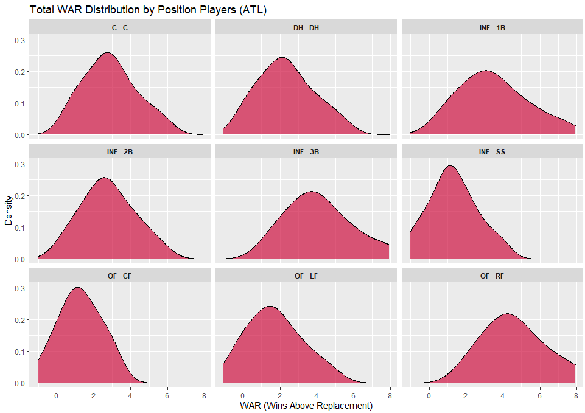
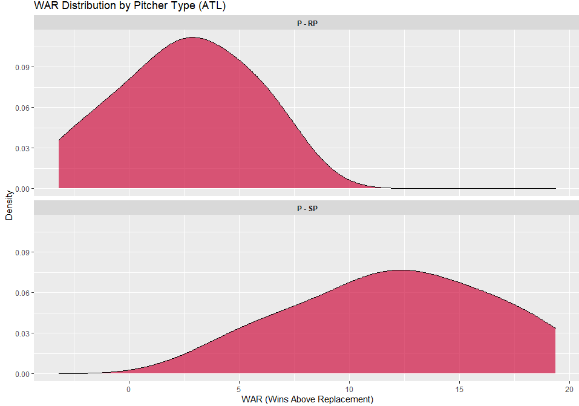

# 
Rebirtha Model
 #
  ### 
*"I know a town where real life's a game. Baseball's all that's real"*
 ###

  
  ## What's the Goal? ##
Code in this repository will aim to predict the winner of every single baseball game in the MLB using a variety of sources and models. The outcome of this game will then be compared to the implied probability of a moneyline. If the advantage is significant, the model's outcome will trigger a bet on my end. Significant value is calculated by taking the Rebirtha Model's probability of winning a given game and subtracting the value derived from the moneyline's implied probability. Bets will be place in proporition to the degree in which the model's probability is greater than the moneyline's probability.
  
  ## How Does It Work? ##
There are a variety of calculations and inputs from various sources that go into creating the model. Below I will outline the process of converting raw data availale on the internet into wagers being placed.
  
  ### 1) Data Collection ###
  
  #### &nbsp;&nbsp;&nbsp;&nbsp;&nbsp;&nbsp;a) Individual Player Projections ####
Before the season starts, I collect projected WAR values and projected playing time data from BaseballProspectus.com. BP is an excellent resource for baseball data, especially projected data using their PECOTA system. I won't go into details here, but you can read more on their [website](https://legacy.baseballprospectus.com/glossary/index.php?mode=viewstat&stat=476).
  
  #### &nbsp;&nbsp;&nbsp;&nbsp;&nbsp;&nbsp;b) Lineups and Starting Pitching ####
I scrape lineups every morning from [BaseballMonster.com](https://baseballmonster.com/lineups.aspx), a popular fantasy baseball resource, and join these to the projections to match players in a starting lineup to their WAR projections. This source has been a bit iffy but I like it because it does attempt to predict the starting lineups for every game before they are confirmed, allowing me to hop on early lines for games later in the day.
  
  #### &nbsp;&nbsp;&nbsp;&nbsp;&nbsp;&nbsp;c) Gambling Lines ####
This has been a trickier thing to standardize and I hope to include multiple sportsbooks in the future. As for now, the lines are scraped from my personal book that I use daily.
  
  #### &nbsp;&nbsp;&nbsp;&nbsp;&nbsp;&nbsp;d) Injuries and Suspensions ####
I scrape data from [SportTrac](https://www.spotrac.com/mlb/disabled-list/") regarding which players are on the DL and for how long. With the MLB and their usage of the 10-Day DL and 60-Day DL classification, it helps to adjust my season long projections that are used as a basis for a team's strength as I assume that 60-Day DL players are either not going to play the rest of the year or will be out a significant portion of the year. I manually input flags for players that have been ruled out for hte entire year to adjust team strength values.
  
  #### &nbsp;&nbsp;&nbsp;&nbsp;&nbsp;&nbsp;e) ClusterLuck ####
In the past, I have used [The Power Rank](https://thepowerrank.com/cluster-luck/) as my source for cluster luck values. However, since they do not update these values daily any more, I have turned to [Fangraph's Base Runs](https://www.fangraphs.com/depthcharts.aspx?position=BaseRuns) metric to adjust for cluster luck. What is cluster luck you may ask? Essentially it is a metric of how many runs a team *should* have scored/given up based on a simple run expectancies matrix. This accounts for good and bad luck with runners on base. This adjustment is crucial to the model as it adjust for variance in-season that many other bettors do not take into account when looking at future performance. To learn more about cluster luch, please read more [here](https://library.fangraphs.com/features/baseruns/).
  
  #### &nbsp;&nbsp;&nbsp;&nbsp;&nbsp;&nbsp;f) Trades and Transactions ####
I scrape data from [ESPNs Transactions page](https://www.espn.com/mlb/transactions) to change a player's team within my projections to adjust a team's total strength. This is updated when trades are made official and it is run before every day to ensure that each team's rosters are completely up to date.
  
  ### 2) Data Manipulations and Calculations ###
I won't get too much into the weeds here since the model is proprietary. However, I will explain the theory behind how the model is set up using the data provided above.
  
  #### &nbsp;&nbsp;&nbsp;&nbsp;&nbsp;&nbsp;a) Standardizing Team Strength ####
To begin, I need to find the totals of WAR values by position for each team. I use Baseball Prospectus's PECOTA projections to put together a likely depth chart and how much WAR a team is likely to produce at certain position. The data is provided in percentiles and from these distributions, I can put together an estimate for how much WAR a team can reasonably expect to accumulate over the course of a season. Below is an example of what that looks like using the 2023 Atlanta Braves's roster:

Position Players

  

Pitchers

  

When put all together, I am able to create a distribution of what the entire team will look like given an average season to create a WAR distribution for each team. Assuming the distribution for the value of WAR to be equal to the total number of wins that a team will end up with, I can then use this mean as a basis for a teams final record which will be used to calculate single game odds. In 2023, I want to use the distribution of WAR for each team to create a variance metric that will help to identify more/less risk than a mean value of WAR, which I have done in the past.

  
  
  #### &nbsp;&nbsp;&nbsp;&nbsp;&nbsp;&nbsp;b) Adjusting Daily Lineups
  On any given day, the lineup that a team puts out will likely not be the same as the one that I have standardized. There are adjustments to be made for this and I will walk through the steps and some of the calculations I use to adjust for this. In adjusting the lineup every day for a given team helps to create an idea of what the record of a team *would be* if this lineup were to play an entire 162 game season. I will get more into the calculations later in this document.
  
  
  ##### &nbsp;&nbsp;&nbsp;&nbsp;&nbsp;&nbsp;&nbsp;&nbsp;&nbsp;&nbsp;&nbsp;&nbsp;i) Batters and Position Players
  For batters, I have discovered in the past that including adjustments in my model every day does not account for a significant difference in the win percentage output. With 9 batters each game, the output of win percentage is not heavily affected when 1/9th of the lineup does not play. There are two reasons to explain why adjusting a team's positional WAR has never significantly affected the output. To give an example, let's use the Pittsburgh Pirates.
  
  &nbsp;&nbsp;&nbsp;&nbsp;&nbsp;&nbsp;1) The Starter:
  
  In Centerfield for the Pirates is Bryan Reynolds. In total, Reynolds is projected to accrue 2.8 WAR over the course of the season. The position as a whole will accrue 2.9 WAR over the course of the season. Reynolds will play CF in 80% of games, likely more. This then assumes that for the other 20% of games where Reynolds does not start, that player will accumulate 0.1 WAR. If Reynolds were to play 100% of games, this value would rise proportionately to the increase in games over 80% that he does play. Below I will show the 162 game calculations for Reynolds and generic CF backups.
  
  | Player      | % in CF | CF WAR | Calculation | 162 WAR |
  |:------------|:-------:|:------:|:-----------:|:-------:|
  |B. Reynolds  |80%      |2.8     |2.8 / 0.80   |3.5      |
  |Backup       |20%      |0.1     |0.1 / 0.20   |0.5      |
  
  WOW! Reynolds is worth over 3 wins in a 162 game season compared to a backup player! That's a lot! I thought that you said it wasn't a big difference!? What does that mean for the adjustment??
  
  In reality, yes, this difference is a lot and it is the reason that the Pirates should be smart and extend Reynolds if they want any shot at success. However for this model, I aim to attack biases like these in a betting market. Among gamblers, position players (with maybe the exception of Judge and Trout) cannot affect a single game as much as other players (i.e., pitchers) can. While Reynolds is worth 3 wins (or 30 runs) more than his backup in a 162 game season, there is only 4/5 plate appearances per game for these players and when the CF only makes up 1/9 of a lineup, the difference between the two values is marginal at best. This difference also only comes into play if Reynolds plays over 80% of games in a season. If he were to play more, the CF WAR would increase at a rate proportional to the percent of games he plays over 80%. For every 16.2 games (10% of season) over 80% that Reynolds plays in CF, he will increase the total CF WAR by 0.35. For every 16.2 games that his backup plays over 20%, they will increase the CF WAR by 0.05. The 0.3 WAR difference per 10 games is only 0.03 per game. In this model, I assume that 1 win is equal to 10 runs. I will get more into the assumption below, but for now, this means that the difference on a per game basis (over or under the allotted 80% of games) is only 0.3 runs. While that is a more significant difference than other positions, Reynolds may also be playing another position in that lineup so the adjustment would really be between the playerin CF and the player that Reynolds displaced in another position.
  
  
  &nbsp;&nbsp;&nbsp;&nbsp;&nbsp;&nbsp;2) The Rotating Cast of Characters:
  
  The "Rotating Cast of Characters" is something the Pirates are well known for and is one of the reasons that they have been unable to find success. What I am referring to is swapping 2 to 4 players in one position. The reason that they split playing time is that they are usually equal players. Sometimes they bring different things to the table like speed or power but likely they are going to produce similar value in that position compared to their buddies playing the same position. Therefore, it is safe to assume that the difference between these players starting or not is such a small difference, that encapturing the value change in the past has never been too much of a probelem when projecting 162 game seasons given a lineup.
  
  
  
  With all of this being said, I have implemented a feature in 2023 that will capture these small difference to make the model even more accurate. I had not done so in the past because the difference were small and I had not created a function that would accomodate for these issues. Below, I will go into detail about the adjustments made for pitchers. THe theory is the same, but the numerical difference are much more significant given the large(er) role that pitchers play in the game of baseball.
  
  
  
  
  
##### &nbsp;&nbsp;&nbsp;&nbsp;&nbsp;&nbsp;&nbsp;&nbsp;&nbsp;&nbsp;&nbsp;&nbsp;ii) Pitchers
  For any given baseball game, the moneyline for an 81-win team (.500) against another 81-win team will vary significantly based on who is pitching compared to any position player. In a hypothetical matchup between two .500 teams, one team can be upwards to a -200 favorite/+200 underdog depending on the pitching matchup. The implied probability difference here is vast given that the two teams are both projected to win 50% of their games. A -200 favorite has an implied probability of 66.67% and a +200 underdog implies a 33.37% chance of winning this hypothetical matchup. *Thats a 33% difference based on pitchers alone!* Therefore. we need to adjust win totals significantly for pitchers. Here's how it works:
  
  
  
  Let's use an example of the Toronto Blue Jays here. This year, the rotation of starting pitchers is projected to produce 9.6 WAR. Most teams carry a rotation of 5 pitchers that will start games throughout a season. However, I want to incorperate all of the data at my hands and use % of starting innings pitched by each starting pitcher instead of just using a value of 5 to determine shares of starter innings pitched over the course of the season. Below is a table showing WAR values for each player and how much they are expected to contribute in a starter role:
  
  
  | Player                | % as SP | SP WAR | Calculation | 162 WAR |
  |:----------------------|:-------:|:------:|:-----------:|:-------:|
  |Kevin Gausman          |18%      |2.5     |2.5 / 0.18   |13.9     |
  |Alek Manoah            |18%      |1.6     |1.6 / 0.18   |8.9      |
  |Chris Bassitt          |17%      |2.1     |2.1 / 0.17   |12.4     |
  |Jose Berrios           |16%      |1.4     |1.4 / 0.16   |8.75     |
  |Yusei Kikuchi          |12%      |1.2     |1.2 / 0.12   |10.0     |
  |Hyun-jin Ryu           |5%       |0.3     |0.3 / 0.05   |6.0      |
  |Other Starters         |14%      |0.5     |0.5 / 0.14   |3.57     |
  |**Total**              |**100%** |**9.6** |**9.6 / 1**  |**9.6**  |
  
  
  From this, we can see that Kevin Gausman on the mound for 162 games would be 4.3 WAR better than the projected total WAR for the entire rotation. Alek Manoah would be 0.7 WAR worse in a 162 game season, and so on and so on. The adjustment here for pitchers is essentially looking at efficiency. The pre-season projection is based on the time spent pitching as a starter, while the adjustment gives us what the roster would look like in a single game.
  
  
  
  Now that the adjustments are complete, it is time to talk ahout how I use these to create a projected win percentage for a team in a single game and spit out a value that can be compared to moneyline odds.
  
  
  
  ### &nbsp;&nbsp;&nbsp;&nbsp;&nbsp;&nbsp;3) The Calculation and Moneyline Comparison
  
  First, I want to go over some assumptions that I use based on historic findings. These are pretty basic and are used as rules of thumb when evaluating the game of baseball from an analytical point of view.
  
  #### &nbsp;&nbsp;&nbsp;&nbsp;&nbsp;&nbsp;a) Assumptions:
  1) Wins and Runs - For every 10 runs that a team scores, they will average one win. This also works in reverse where every 10 theoretical runs a team *does not* give up, they will average one win. As WAR is Wins Above Replacement, we can convert 1 WAR to 10 runs above replacement.
  
  
  2) Pythagreon Win Percentage - This one exists almost everywhere and I don't want to get into to much detail. But the theory is that given a team's runs scored and runs allowed, we can project a team's final win percentage. Read more [here](https://www.mlb.com/glossary/advanced-stats/pythagorean-winning-percentage).
  
  
  #### &nbsp;&nbsp;&nbsp;&nbsp;&nbsp;&nbsp;b) Calculations:
  Using the input of an adjusted WAR value based on a team's lineup, we can derive a win percentage for each team playing in a single game if the lineups. Using the 162 game season value of WAR for a lineup, we convert the difference of WAR between the current lineup and the whole season projection. 
  
  
  
  Then I turn this into runs by multiplying by 10. For pitchers I multiply the WAR difference by -10 to get an adjusted number of runs allowed if certain pitchers are on the mound. For batters, we multiply by 10. Then those numbers are added to my projected runs scored/allowed at the beginning of the season. From there we use the pythagreon winning percentage formula to create a hypothetical win percentage if this lineup played a full season.
  
  
  Next up is multiplying a win percentage for the home team against a win percentage for the away team. Let's use the Pirates and Blue Jays as an example. Say the Pirates hypothetical win percentage is 0.400 and the Blue Jays' is 0.600. From this I can take the opposite of winning (losing) and say that the Pirates' lose percentage is 0.600 and the Blue Jays' is 0.400. Using basic probability there are 4 potential outcomes: **1) a Pirates Win and Blue Jays Loss, 2) a Pirates Loss and a Blue Jays Win, 3) a Pirates Win and a Blue Jays Win, and 4) a Pirates Loss and a Blue Jays Loss.** The calculations for these scenarios are below:
  
  
  
  
  | Scenario              | PIT % | TOR % | Probability| Value |
  |:----------------------|:-----:|:-----:|:----------:|:-----:|
  |PIT WIN & TOR LOSS     |40%    |40%    |0.4 x 0.4   |0.16   |
  |PIT WIN & TOR WIN      |40%    |60%    |0.4 x 0.6   |0.24   |
  |PIT LOSS & TOR WIN     |60%    |60%    |0.6 x 0.6   |0.36   |
  |PIT LOSS & TOR LOSS    |60%    |40%    |0.6 x 0.4   |0.24   |
  
  
Now obviously, both teams cannot win and both teams cannot lose. So we can eliminate those scenarios after calculating. From there we take the total possibility that (PIT wins & TOR loses) + (TOR wins & PIT loses). This comes out to 0.52 (0.16+0.36). Now we take 0.16/0.52 to find the probability that PIT wins, and do the same for TOR (0.36/0.52). We end up with **PIT winning this game 30.76% of the time and Toronto winning this game 69.23% of the time**. Now it's time to compare to Vegas.
  
  
  
  #### &nbsp;&nbsp;&nbsp;&nbsp;&nbsp;&nbsp;c) Moneyline Comparison and Bet Decision:
  
  
To compare to a moneyline, we need to convert American odds (-110, -200 +115, etc.) to a probability. You can use this calculator [here](https://www.gamingtoday.com/tools/implied-probability/) to play around with certain odds. An implied probability is the implied winning percentage for a given team in a game using gambling markets. When a book sets a price, we are able to use that implied probability to compare to my win percentages above.
  
  
  Using our example from above, let's say that Toronto are heavy favorites at -300 and Pittsburgh are +270 underdogs (don't worry, they're used to it). Converting these values to implied probability we get an implied probability of 75.00% for Toronto winning the game and 27.03% chance Pittsburgh wins this game according to the market. Below is a table showing the comparison of Rebirtha's probability to Vegas.
  
  
  *If Rebirtha Prob > Vegas Prob, then we have found value and will place a bet. The size of the bet is determined by the magnitude of the difference*
  
  
  
  | Team       | Rebirtha  | Vegas    | Difference | Bet?|
  |:-----------|:---------:|:--------:|:----------:|:----|
  |Toronto     |69.23%     |75.00%    |-5.77%      |No   |
  |Pittsburgh  |30.76%     |27.03%    |+3.77%      |Yes  |
  
  
  ### 4) Conclusion ###
  
  
  Essentially, this method of evaluating baseball games has been decently successful in the past and my hope is that I can implement changes every year to either improve the underlying data, my calculations, and/or the automation of certain processes. This model has taken various forms in Excel and Google Sheets, but I believe R has been the way to go in keeping this model running smoothly throughout the year and for many years to come. If you would like to know more or be included in my group chat where I send picks every day, please reach out and I will be more than happy to talk about the Rebirtha Model. Here's to a beautiful 2023 season! Best of luck!
