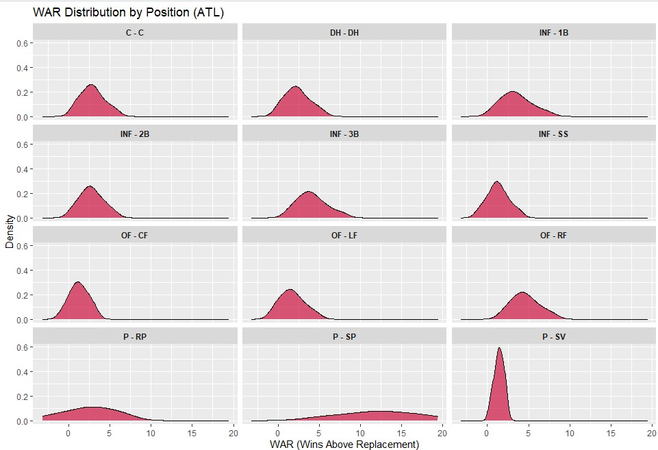

# 
Rebirtha Model
 #
  ### 
*"I know a town where real life's a game. Baseball's all that's real"*
 ###

  
  ## What's the Goal? ##
Code in this repository will aim to predict the winner of every single baseball game in the MLB using a variety of sources and models. The outcome of this game will then be compared to the implied probability of a moneyline. If the advantage is significant, the model's outcome will trigger a bet on my end. Significant value is calculated by taking the Rebirtha Model's probability of winning a given game and subtracting the value derived from the moneyline's implied probability. Bets will be place in proporition to the degree in which the model's probability is greater than the moneyline's probability.
  
  ## How Does It Work? ##
There are a variety of calculations and inputs from various sources that go into creating the model. Below I will outline the process of converting raw data availale on the internet into wagers being placed.
  
  ### 1) Data Collection ###
  
  #### &nbsp;&nbsp;&nbsp;&nbsp;&nbsp;&nbsp;a) Individual Player Projections ####
Before the season starts, I collect projected WAR values and projected playing time data from BaseballProspectus.com. BP is an excellent resource for baseball data, especially projected data using their PECOTA system. I won't go into details here, but you can read more on their [website](https://legacy.baseballprospectus.com/glossary/index.php?mode=viewstat&stat=476).
  
  #### &nbsp;&nbsp;&nbsp;&nbsp;&nbsp;&nbsp;b) Lineups and Starting Pitching ####
I scrape lineups every morning from [BaseballMonster.com](https://baseballmonster.com/lineups.aspx), a popular fantasy baseball resource, and join these to the projections to match players in a starting lineup to their WAR projections. This source has been a bit iffy but I like it because it does attempt to predict the starting lineups for every game before they are confirmed, allowing me to hop on early lines for games later in the day.
  
  #### &nbsp;&nbsp;&nbsp;&nbsp;&nbsp;&nbsp;c) Gambling Lines ####
This has been a trickier thing to standardize and I hope to include multiple sportsbooks in the future. As for now, the lines are scraped from my personal book that I use daily.
  
  #### &nbsp;&nbsp;&nbsp;&nbsp;&nbsp;&nbsp;d) Injuries and Suspensions ####
I scrape data from [SportTrac](https://www.spotrac.com/mlb/disabled-list/") regarding which players are on the DL and for how long. With the MLB and their usage of the 10-Day DL and 60-Day DL classification, it helps to adjust my season long projections that are used as a basis for a team's strength as I assume that 60-Day DL players are either not going to play the rest of the year or will be out a significant portion of the year. I manually input flags for players that have been ruled out for hte entire year to adjust team strength values.
  
  #### &nbsp;&nbsp;&nbsp;&nbsp;&nbsp;&nbsp;e) ClusterLuck ####
In the past, I have used [The Power Rank](https://thepowerrank.com/cluster-luck/) as my source for cluster luck values. However, since they do not update these values daily any more, I have turned to [Fangraph's Base Runs](https://www.fangraphs.com/depthcharts.aspx?position=BaseRuns) metric to adjust for cluster luck. What is cluster luck you may ask? Essentially it is a metric of how many runs a team *should* have scored/given up based on a simple run expectancies matrix. This accounts for good and bad luck with runners on base. This adjustment is crucial to the model as it adjust for variance in-season that many other bettors do not take into account when looking at future performance. To learn more about cluster luch, please read more [here](https://library.fangraphs.com/features/baseruns/).
  
  #### &nbsp;&nbsp;&nbsp;&nbsp;&nbsp;&nbsp;f) Trades and Transactions ####
I scrape data from [ESPNs Transactions page](https://www.espn.com/mlb/transactions) to change a player's team within my projections to adjust a team's total strength. This is updated when trades are made official and it is run before every day to ensure that each team's rosters are completely up to date.
  
  ### 2) Data Manipulations and Calculations ###
I won't get too much into the weeds here since the model is proprietary. However, I will explain the theory behind how the model is set up using the data provided above.
  
  ####&nbsp;&nbsp;&nbsp;&nbsp;&nbsp;&nbsp;a) Standardizing Team Strength
To begin, I need to find the totals of WAR values by position for each team. I use Baseball Prospectus's PECOTA projections to put together a likely depth chart and how much WAR a team is likely to produce at certain position. The data is provided in percentiles and from these distributions, I can put together an estimate for how much WAR a team can reasonably expect to accumulate over the course of a season. Below is an example of what that looks like using the 2023 Atlanta Braves's roster:
 

  
